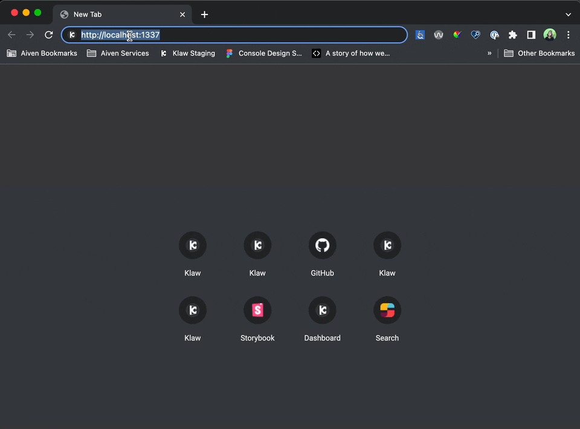

# Development with local Klaw API

ℹ️ The proxy is a work in progress.

Please check out the [proxy README](../proxy/README.md) for more detailed information on how to use the proxy in your development process. You'll also find explanation and workaround for the things that are currently not working.

## Table of content

* [First setup](#first-setup)
+ [Note to login and authentication](#note-to-login-and-authentication)
    * [Login ](#login)
    * [Authentication expired](#authentication-expired)
    - [🙋Potential browser problem](#potential-browser-problem)
* [How to run the project](#how-to-run-the-project)

 
## First setup

ℹ️ environment settings are located in the file [`.env.local-api`](../../coral/.env.local-api).

** ℹRequirements**

- [node](https://nodejs.org/en/) needs to be installed  
  -> see [nvmrc](../.nvmrc) or the `engines` definition in [package.json](../package.json) for version).
- Coral uses [pnpm](https://pnpm.io/) (version 7) as a package manager. Read their official documentation [how to install](https://pnpm.io/installation) pnpm.

1. Navigate to [`/coral`](../../coral)
2. Run `pnpm install`
3. Run `pnpm add-precommit` the first time you install the repository to set the custom directory for our pre commit hooks.
4. Go to directory [`coral/proxy`](../../coral/proxy)
5. Run `pnpm install` there, too
6. Install and run Docker - [Get Docker](https://docs.docker.com/get-docker/)
7. Go to directory [`coral/proxy`](../../coral/proxy)
8. Run `pnpm install` if you haven't already
9. Run `ppm setup`
   `pnpm setup` will build and deploy your docker container for:
    - Klaw core: the main API Coral interacts with
    - Klaw cluster api: the API interacting with the Kafka clusters managed by Klaw
    - Kafka, zoo-keeper, schema-registry: a basic Kafka setup
10. Run `pnmv dev:[start|restart]`
    - check out the [documentation](../../coral/proxy/README.md) for more scripts and information when to use them.
    - the proxy runs on [`http://localhost:1337`](http://localhost:1337)
    - Login - ❗️The correct redirect for login and authentication is **not** working in the proxy yet. To login:
        - Go to your [local Klaw](http://localhost:9097/login)
        - Login as superadmin with: `superadmin`, password `kwsuperadmin123$$` (see [application.properties](../../core/src/main/resources/application.properties))
        - Go back to the [proxy](http://localhost:1337)
11. As superadmin, create one ore more users [proxy](http://localhost:1337/users)
   "User" and "superadmin" are roles that have authorization to different views and functionality. We're migrating the user views in Coral first, so you'll need to login to Coral with a "user" account to have access to all functionality.
12. As superadmin, add a cluster and environment - you can follow our [official documentation](https://www.klaw-project.io/docs/getstarted)
13. Bootstrap server for Kafka cluster is `http://klaw-kafka:9092`, which is running in your docker
14. Bootstrap server SchemaRegistry is `klaw-schema-registry:8081`, which is running in your docker.
15. In [settings](`http://localhost:1337/serverConfig`), add the Cluster api `http://klaw-cluster-api:9343`, which is running in your docker. You can test the connection, using the button.
16. You are good to go! 🎉

### Note to login and authentication

The correct redirect for login and authentication is **not** working yet.**

##### Login 

- Go to your [local Klaw](http://localhost:9097/login)
- Login with your credentials
- After you've been sucessfully logged in, go back to the proxy -> [`http://localhost:1337`](http://localhost:1337)

##### Authentication expired
Related to that the proxy currently also does not redirect you to the login if your access expires. If you're getting related errors from your API, please login again like described above 🙏

#### 🙋Potential browser problem
**The proxy and Klaw are running with `http`. Your browser may show you an error (SSL connection error), because it tries to automatically upgrade to https, without making an http request for security. You have to allow `localhost` to be accessed via http explicitly.** 

ℹ️ When you're done, you can run either: 
- `pnpm dev:stop` to stop all containers in docker (enables a fast restart) 
- `pnpm dev:destroy` to tear down all containers in docker (you'll have to run `pnpm setup` or `pnpm:start` again next time you want to use them, so they get build again)

## How to run the project

If all requirements are met, and you've done your first setup, these are the scripts you can use in the directory `/proxy`:

- `pnpm dev:start` to build and start your docker container for klaw and cluster api. This runs tests and build for Klaw, which takes some time.
- `pnpm dev:start:testEnv` to build and start your docker container for klaw and cluster api as well as a sandbox with zookeeper, kafka and a schema-registry (note: these files are large!). Same as above, this will run tests and do a new build.
- `pnpm dev:restart` to restart you container. Used when you already have build Klaw in a container and there are now changes. It restarts the container without new build.
- `pnpm dev:restart:testEnv` to restart you container including sandbox. Same as above, this will not do a new build.
- `pnpm:stop` to stop your running containers.
- `pnpm:destroy` to stop and teardown your running containers (will require you to run :start the next time again).

- Please check out the [proxy README](../proxy/README.md) for more detailed information and a deeper breakdown of all available scripts.