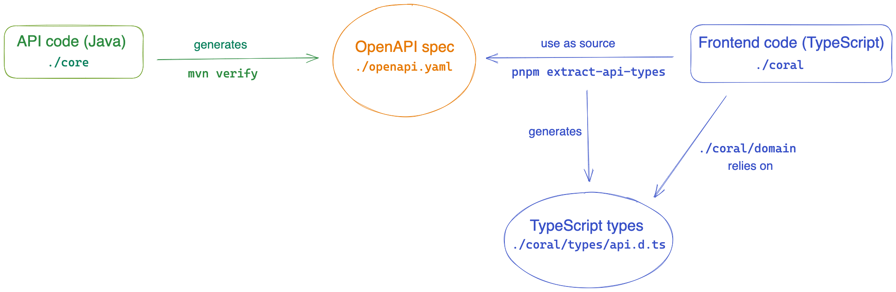

## What is the Klaw API source of truth?

The OpenAPI spec `./openapi.yaml` at the root of the project is our source of truth. It is _auto-generated_ from the current state of the API code, and is therefore always up to date with the current state of the API.

We use this OpenAPI spec as a source for the generation of the TypeScript types the frontend relies on to accurately type our business logic (mainly in [the `.coral/domain` folder](../coral/docs/directory-structure.md#first-level-domain-folder)).

Therefore, every time the API changes, the OpenAPI spec will change, and the generated types for the frontend will keep in sync with the evolution of the API.

## Generating the OpenAPI spec and TypeScript types

This is a high level diagram of the process described above.

